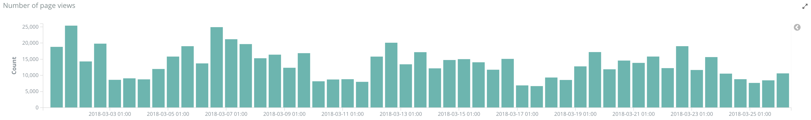
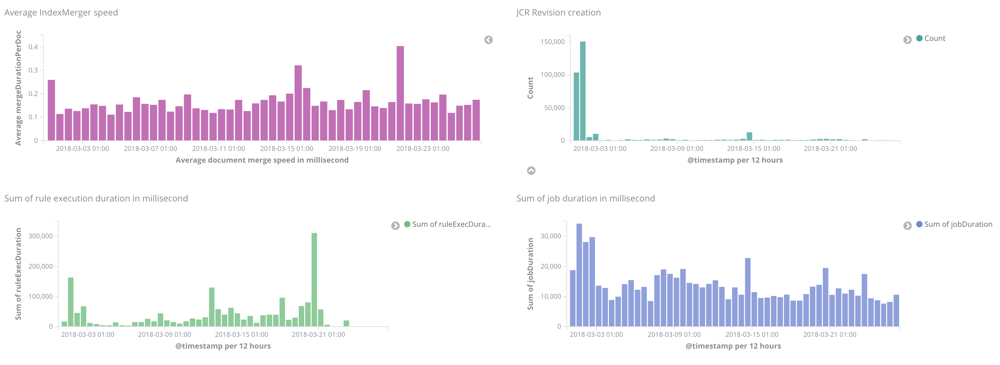
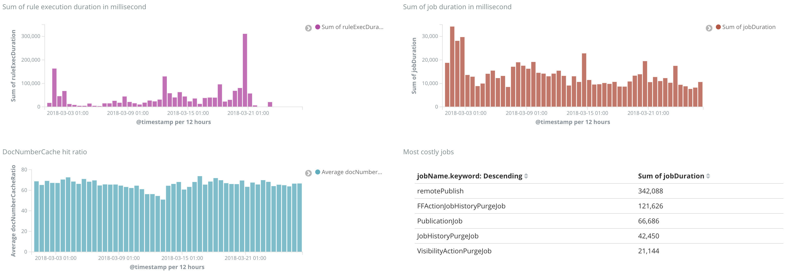
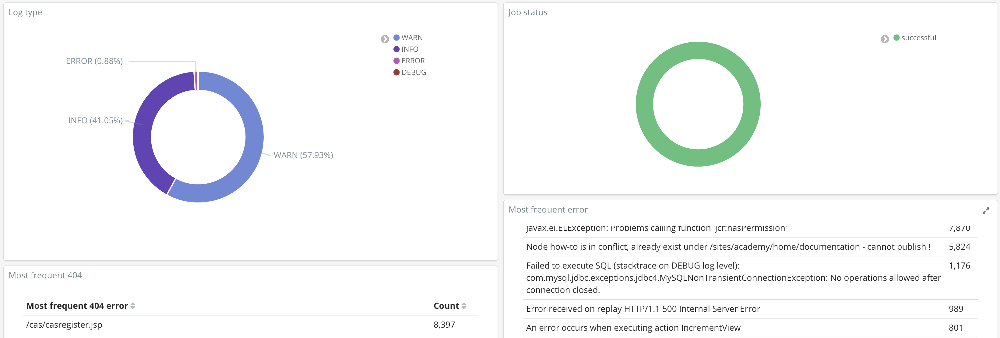

# docker-jahia-elk

This repository features the full Elasticsearch-Logstash-Kibana stack inside a Docker image, with pre-packaged configuration that can be used to monitore Jahia Digital Experience 7+ jahia.log files. It contains Logstash patterns as well as Kibana dashboards.

This Docker image can be used to index logs generated on the fly on a running Jahia DX platform, or to analyze logs on a static folder.

All logstash patterns and kibana dashboards come from the following Github repository: https://github.com/Jahia/jahia-logstash-kibana-config
All logstash/kibana related pull requests need to be sent against the jahia-logstash-kibana-config repo.

## How to use this Dockerfile
* Clone: `git clone https://github.com/Jahia/docker-jahia-elk.git`
* Access folder: `cd docker-jahia-elk`
* Build: `docker build -t jahia/elk:0.12 .`
* Run: `sudo docker run -p 5601:5601 --rm -v <LOCAL_PATH_TO_LOG_FOLDER>:/var/logs/logstash_logs -e MAX_MAP_COUNT=262144 -it --name jahia-elk jahia/elk:0.12` (The `LOCAL_PATH_TO_LOG_FOLDER` folder needs to contain a least one file matching the pattern \*jahia.log\*)
* Access `http://localhost:5601`
* Go to Management > Saved objects > Import and pick export_0.8.json <GitRepo>/kibana/jahia_dashboards.json. Click yes for all questions.
* Go to Dashboard > Jahia or Dashboard > Jahia issues
* Pick the time range you want to analyze (top right corner)

When finished with the Docker image, run the `docker stop jahia-elk` to stop it.

## Options
* Persist Elasticsearch's index upon Docker image restart: `-v <Local_path_to_index>:/var/lib/elasticsearch`
The local path to index must point to an empty folder.

## Features:
 * Jahia page rendering monitoring (render time, paths, users, errors)
 * Garbage collection monitoring
 * JahiaRequestLoad and JahiaSessionLoad monitoring

## Log indexing options
 * `-XX:+PrintGCDateStamps` should be added to tomcat/bin/setenv.sh in order to allow for Garbage Collection monitoring. The configuration is optional.
